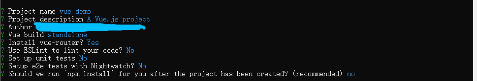

# 1. 如何新建一个vue项目
## 1.1. 像导入jQuery引入
```
 <script src="https://cdn.staticfile.org/vue/2.2.2/vue.min.js"></script>
```
## 1.2. 命令行方式
- cmd调出命令行，cd到想要放该项目的目录下
```
 vue init webpack vue-demo(vue-demo为项目名)
```

- 随后会出现项目的一些配置，参考如下



- 依次输入下面的命令


-  访问http://localhost:8080/既可以访问到页面